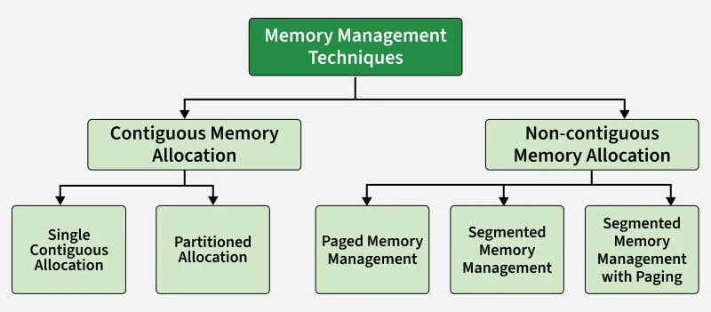

# Operating Systems
---

## 📌 Index

1. [What is an Operating System?](#what-is-an-operating-system)
2. [Types of Operating Systems](#types-of-operating-systems)
3. [Kernel in Operating Systems](#kernel-in-operating-systems)
   - [Types of Kernel](#types-of-kernel)
   - [Functions of Kernel](#functions-of-kernel)
   - [Working of Kernel](#working-of-kernel)
4. [System Calls](#system-calls)
5. [System Initialization](#system-initialization)
   - [Linux Boot Process](#linux-boot-process)
   - [Windows Boot Process](#windows-boot-process)
   - [Linux vs Windows Boot Comparison](#linux-vs-windows-boot-comparison)
6. [Process Management](#process-management)
   - [Process](#process)
   - [Threads](#threads)
   - [Process vs Thread](#process-vs-thread)
   - [Process Management Tasks](#process-management-tasks)
   - [CPU Scheduling](#cpu-scheduling)
   - [Process Synchronization](#process-synchronization)
7. [Memory Management](#memory-management)
   - [Registers and Addressing](#registers-and-addressing)
   - [Swapping](#swapping)
   - [Types of Memory Allocation](#types-of-memory-allocation)
8. [File Systems](#file-systems)
9. [Input/Output Management](#inputoutput-management)
---


## What is an Operating System?

An operating system (OS) is a software that acts as an intermediary between computer hardware and the user. It manages hardware resources, provides a user interface, and enables the execution of application software. The OS is responsible for tasks such as memory management, process scheduling, file management, and device control.


## Types of Operating Systems

1. **Batch Operating Systems**: These systems execute batches of jobs without user interaction. They are used in environments where tasks can be processed in groups, such as in mainframe computers.
2. **Time-Sharing Operating Systems**: These systems allow multiple users to interact with the computer simultaneously by sharing system resources. Each user gets a time slice of the CPU, enabling multitasking.
3. **Distributed Operating Systems**: These systems manage a group of independent computers and make them appear as a single system to users. They enable resource sharing and communication between computers in a network.
4. **Real-Time Operating Systems**: These systems are designed to process data in real-time, providing immediate responses to events. They are used in applications where timing is critical, such as in embedded systems and industrial control systems.
5. **Mobile Operating Systems**: These systems are designed for mobile devices such as smartphones and tablets. They provide a user-friendly interface and support for touch input, wireless communication, and app ecosystems.


## Kernel in Operating Systems

A kernel is the core part of an operating system. It acts as a bridge between software applications and the hardware of a computer.

- The kernel manages system resources such as the CPU, memory, and devices, ensuring everything works together smoothly and efficiently.
- It handles tasks like running programs, accessing files, and connecting to devices like printers and keyboards.
- An operating system includes the kernel as its core, but also provides a user interface, file system management, network services, and various utility applications that allow users to interact with the system.

### Types of Kernel

- **Monolithic Kernel:** All OS services run in kernel space. Fast performance, but less fault-isolation since a bug in any service can crash the entire system.
  - Examples: Unix, Linux, OpenVMS, XTS-400
- **Microkernel:** Only minimal functionality (IPC, basic scheduling, memory management) runs in kernel space; most services are moved to user space. Better reliability and modularity, but more overhead due to frequent context switching.
  - Examples: Minix 3, Mach 3.0
- **Hybrid Kernel:** Combines monolithic and microkernel ideas — some services run in kernel space for speed, while others are isolated in user space for safety.
  - Examples: Windows NT family (2000, XP, Vista, 7, 8, 10, 11), macOS (XNU), ReactOS, Haiku OS
- **Nanokernel:** Extremely minimal kernel that provides only basic hardware abstraction; everything else runs outside the kernel.
  - Examples: Nemesis, MIT Exokernel projects (XOK, Aegis)
- **Exokernel:** The kernel handles only protection (security and isolation between programs) and gives applications direct access to hardware resources instead of managing them itself.
  - Examples: MIT Exokernel, Xok, ExOS

| Type | Services in Kernel | Performance | Fault Isolation | Example |
|---|---|---|---|---|
| **Monolithic** | All | High | Low | Linux |
| **Microkernel** | Minimal | Lower (overhead) | High | Minix 3 |
| **Hybrid** | Some | Balanced | Moderate | Windows NT, macOS |
| **Nanokernel** | Bare minimum | Varies | High | Nemesis |
| **Exokernel** | Protection only | High (direct HW access) | Application-dependent | MIT Exokernel |

### Functions of Kernel

- **Process Management:** Scheduling and execution of processes, creating and terminating processes, and managing process states.
- **Memory Management:** Allocation and deallocation of memory space, managing virtual memory, handling memory protection and sharing.
- **Device Management:** Managing input/output devices, providing a unified interface for hardware devices, and handling device driver communication.
- **File System Management:** Managing file operations such as reading, writing, creating, and deleting files, and providing a file system interface to applications.
- **Resource Management:** Managing system resources (CPU time, disk space, network bandwidth) and allocating/deallocating resources as needed.
- **Security and Access Control:** Enforcing access control policies like user permissions, authentication, and preventing unauthorized access to resources.
- **Inter-Process Communication (IPC):** Facilitating communication between processes by providing mechanisms like message passing, shared memory, and pipes.

### Working of Kernel

1. The kernel is the first part of the OS loaded into memory during boot, and it stays resident while the system is running.
2. It operates in a privileged mode (**kernel mode**), separate from **user mode** for applications — user apps cannot directly access hardware or critical resources.
3. Applications make requests to the kernel via **system calls** (or software interrupts). The kernel handles these by switching from user mode to kernel mode.
4. The kernel executes the requested operation (e.g., file I/O, process creation, memory allocation).
5. On completion, the kernel returns the result (or error) to user space and switches back to user mode.
6. The kernel performs **context switching** as needed — the scheduler picks the next process/thread to allow multitasking.

> **🎯 Interview Tip:** "The kernel is the core of the OS that bridges software and hardware. It runs in privileged kernel mode and handles process management, memory management, device management, file systems, IPC, and security. Monolithic kernels run all services in kernel space for speed (Linux), microkernels move most services to user space for reliability (Minix), and hybrid kernels combine both approaches (Windows, macOS). Applications interact with the kernel through system calls, which trigger a user-mode to kernel-mode transition."


## System Calls

System calls are the mechanism by which user applications request services from the operating system's kernel. They provide a controlled interface for applications to interact with hardware and system resources while maintaining security and stability.

### Types of System Calls
1. **Process Control:** Create, terminate, and manage processes (e.g., `fork()`, `exec()`, `wait()`).
2. **File Management:** Create, read, write, and delete files (e.g., `open()`, `read()`, `write()`, `close()`).
3. **Device Management:** Interact with hardware devices (e.g., `ioctl()`, `read()`, `write()` for device files).
4. **Information Maintenance:** Get system information (e.g., `getpid()`, `gettimeofday()`, `uname()`).
5. **Communication:** Facilitate inter-process communication (e.g., `pipe()`, `shmget()`, `msgget()`).
6. **Memory Management:** Allocate and deallocate memory (e.g., `mmap()`, `munmap()`, `brk()`).


## System Initialization

System initialization (booting) is the process that occurs when a computer is powered on or restarted. It involves several stages to load the operating system from storage into memory and prepare the system for user interaction.

### Linux Boot Process

<table align="center" style="border-collapse: collapse; text-align: center;">
  <tr>
    <th>Stage</th>
    <th>Component</th>
    <th>Function</th>
  </tr>
  <tr>
    <td>1</td>
    <td><b>BIOS / UEFI</b></td>
    <td>Power-On Self Test (POST), hardware check, locates boot device</td>
  </tr>
  <tr><td colspan="3">⬇️</td></tr>
  <tr>
    <td>2</td>
    <td><b>MBR / GPT</b></td>
    <td>Master Boot Record loads the bootloader from disk</td>
  </tr>
  <tr><td colspan="3">⬇️</td></tr>
  <tr>
    <td>3</td>
    <td><b>GRUB2 (Bootloader)</b></td>
    <td>Displays OS menu, loads kernel + initramfs into memory</td>
  </tr>
  <tr><td colspan="3">⬇️</td></tr>
  <tr>
    <td>4</td>
    <td><b>Kernel</b></td>
    <td>Initializes hardware, mounts root filesystem, starts first process</td>
  </tr>
  <tr><td colspan="3">⬇️</td></tr>
  <tr>
    <td>5</td>
    <td><b>Init System (systemd)</b></td>
    <td>PID 1 — starts services, mounts filesystems, sets up networking</td>
  </tr>
  <tr><td colspan="3">⬇️</td></tr>
  <tr>
    <td>6</td>
    <td><b>Runlevel / Target</b></td>
    <td>Reaches desired state (multi-user, graphical, etc.)</td>
  </tr>
  <tr><td colspan="3">⬇️</td></tr>
  <tr>
    <td>7</td>
    <td><b>Login Prompt / GUI</b></td>
    <td>User authentication — getty (TTY) or Display Manager (GDM/SDDM)</td>
  </tr>
</table>

<p align="center"><i>Linux: BIOS/UEFI → MBR/GPT → GRUB2 → Kernel → systemd → Target → Login</i></p>

**Stage Details:**

1. **BIOS/UEFI:** Firmware performs POST (checks CPU, RAM, peripherals), identifies the boot device (HDD, SSD, USB), and hands control to the bootloader.
2. **MBR/GPT:** The first sector of the boot disk contains the Master Boot Record (legacy) or GUID Partition Table (modern UEFI) which points to the bootloader.
3. **GRUB2 (Bootloader):** Grand Unified Bootloader presents a menu to select the OS/kernel version, loads the compressed kernel image (`vmlinuz`) and initial RAM filesystem (`initramfs`) into memory.
4. **Kernel:** Decompresses itself, initializes CPU, memory, and device drivers, mounts the initial ramdisk, then mounts the real root filesystem and executes `/sbin/init` (or `systemd`).
5. **Init System (systemd/SysVinit):** The first user-space process (PID 1). `systemd` starts services in parallel based on unit files, mounts remaining filesystems, configures networking.
6. **Runlevel/Target:** The system reaches the configured target — `multi-user.target` (no GUI) or `graphical.target` (with desktop environment).
7. **Login Prompt:** `getty` provides TTY login for CLI, or a Display Manager (GDM, SDDM, LightDM) provides graphical login.

---

### Windows Boot Process

<table align="center" style="border-collapse: collapse; text-align: center;">
  <tr>
    <th>Stage</th>
    <th>Component</th>
    <th>Function</th>
  </tr>
  <tr>
    <td>1</td>
    <td><b>UEFI / BIOS</b></td>
    <td>Power-On Self Test (POST), hardware check, locates boot device</td>
  </tr>
  <tr><td colspan="3">⬇️</td></tr>
  <tr>
    <td>2</td>
    <td><b>Windows Boot Manager</b></td>
    <td>bootmgfw.efi — reads BCD store, selects OS entry</td>
  </tr>
  <tr><td colspan="3">⬇️</td></tr>
  <tr>
    <td>3</td>
    <td><b>Windows Boot Loader</b></td>
    <td>winload.efi — loads kernel (ntoskrnl.exe) + HAL + drivers</td>
  </tr>
  <tr><td colspan="3">⬇️</td></tr>
  <tr>
    <td>4</td>
    <td><b>NT Kernel</b></td>
    <td>Initializes memory manager, object manager, loads registry</td>
  </tr>
  <tr><td colspan="3">⬇️</td></tr>
  <tr>
    <td>5</td>
    <td><b>Session Manager (smss.exe)</b></td>
    <td>Creates system environment, starts subsystems (Win32)</td>
  </tr>
  <tr><td colspan="3">⬇️</td></tr>
  <tr>
    <td>6</td>
    <td><b>Winlogon + Services</b></td>
    <td>csrss.exe (Win32), services.exe (SCM), lsass.exe (security)</td>
  </tr>
  <tr><td colspan="3">⬇️</td></tr>
  <tr>
    <td>7</td>
    <td><b>Login Screen (LogonUI)</b></td>
    <td>User authentication — credentials verified by LSASS</td>
  </tr>
  <tr><td colspan="3">⬇️</td></tr>
  <tr>
    <td>8</td>
    <td><b>Explorer.exe (Desktop)</b></td>
    <td>User shell loaded — taskbar, desktop, startup programs</td>
  </tr>
</table>

<p align="center"><i>Windows: UEFI → Boot Manager → Boot Loader → NT Kernel → smss.exe → Services → Login → Desktop</i></p>

**Stage Details:**

1. **UEFI/BIOS:** Performs POST, initializes hardware, locates the EFI System Partition (ESP) or MBR, and transfers control to the Windows Boot Manager.
2. **Windows Boot Manager (bootmgfw.efi):** Reads the Boot Configuration Data (BCD) store, presents OS selection menu if multiple entries exist, and invokes the Windows Boot Loader.
3. **Windows Boot Loader (winload.efi):** Loads the NT kernel (`ntoskrnl.exe`), Hardware Abstraction Layer (`hal.dll`), and boot-start device drivers into memory.
4. **NT Kernel (ntoskrnl.exe):** Initializes the executive subsystems — memory manager, process manager, I/O manager, object manager. Loads the registry hive (SYSTEM) and starts boot drivers.
5. **Session Manager (smss.exe):** The first user-mode process. Creates environment variables, page file, starts the Win32 subsystem (`csrss.exe`), and launches `winlogon.exe`.
6. **Winlogon + Services:** `winlogon.exe` starts the Local Security Authority (`lsass.exe`) and Service Control Manager (`services.exe`) which launches Windows services (networking, audio, etc.).
7. **Login Screen (LogonUI.exe):** Presents the lock/login screen. User credentials are verified by LSASS against SAM database or Active Directory.
8. **Explorer.exe:** After successful login, the user shell is loaded — desktop, taskbar, Start menu, and startup programs are initialized.

---

### Linux vs Windows Boot Comparison

| Aspect | Linux | Windows |
|---|---|---|
| **Firmware** | BIOS / UEFI | BIOS / UEFI |
| **Bootloader** | GRUB2 | Windows Boot Manager + winload.efi |
| **Kernel** | vmlinuz (Linux kernel) | ntoskrnl.exe (NT kernel) |
| **Init process** | systemd (PID 1) | smss.exe → winlogon.exe |
| **Service manager** | systemd (unit files) | services.exe (SCM) |
| **Boot config** | /boot/grub/grub.cfg | BCD (Boot Configuration Data) |
| **Login** | getty (CLI) / GDM, SDDM (GUI) | LogonUI.exe |
| **User shell** | bash / Desktop Environment | explorer.exe |

> **🎯 Interview Tip:** "System initialization begins with BIOS/UEFI performing POST and locating the boot device. In Linux, GRUB2 loads the kernel which starts systemd (PID 1) to bring up services and reach the login target. In Windows, the Boot Manager reads BCD, winload.efi loads ntoskrnl.exe, then smss.exe initializes the session, services.exe starts system services, and LogonUI handles authentication before loading explorer.exe as the user shell. The key difference is Linux uses systemd for parallel service startup, while Windows uses the Service Control Manager (SCM)."


## Process Management

Process management is a core function of an Operating System (OS). It deals with creating, scheduling, and coordinating processes to ensure efficient CPU utilization and smooth system performance.

- **Single-tasking systems** are easy to manage since only one process runs at a time.
- **Multiprogramming/multitasking systems** are more complex, as multiple processes need to share the CPU efficiently.
- **Active processes** may share memory and other resources, requiring careful management.
- **Process synchronization** is necessary when processes interact or communicate to avoid conflicts.

### Process

A process is an instance of a program in execution. When a program is loaded into memory and starts running, it becomes a process.

- Each process has its own **address space** (code, data, heap, stack) isolated from other processes.
- The OS assigns a unique **Process ID (PID)** to every process.
- A process is managed through a **Process Control Block (PCB)** which stores all information the OS needs about it.

**Process Control Block (PCB):**

| Field | Description |
|---|---|
| **Process ID (PID)** | Unique identifier for the process |
| **Process State** | Current state (New, Ready, Running, Waiting, Terminated) |
| **Program Counter** | Address of the next instruction to execute |
| **CPU Registers** | Saved register values for context switching |
| **Memory Info** | Page tables, segment tables, base/limit registers |
| **I/O Info** | List of open files, allocated I/O devices |
| **Scheduling Info** | Priority, CPU burst time, scheduling queue pointers |

**Process States:**

<table align="center" style="border-collapse: collapse; text-align: center;">
  <tr>
    <th>State</th>
    <th>Description</th>
  </tr>
  <tr>
    <td><b>New</b></td>
    <td>Process is being created</td>
  </tr>
  <tr><td colspan="2">⬇️</td></tr>
  <tr>
    <td><b>Ready</b></td>
    <td>Waiting in the ready queue to be assigned to a CPU</td>
  </tr>
  <tr><td colspan="2">⬇️</td></tr>
  <tr>
    <td><b>Running</b></td>
    <td>Instructions are being executed by the CPU</td>
  </tr>
  <tr><td colspan="2">⬇️ (I/O or event wait) ↩️ (I/O complete)</td></tr>
  <tr>
    <td><b>Waiting (Blocked)</b></td>
    <td>Process is waiting for I/O operation or event to complete</td>
  </tr>
  <tr><td colspan="2">⬇️</td></tr>
  <tr>
    <td><b>Terminated</b></td>
    <td>Process has finished execution</td>
  </tr>
</table>

<p align="center"><i>New → Ready → Running → Terminated (or Running → Waiting → Ready)</i></p>

**Process Operations:**
- **Creation:** A parent process creates child processes using system calls like `fork()` (Linux) or `CreateProcess()` (Windows). The child gets its own copy of the address space.
- **Termination:** A process ends when it calls `exit()`, or the parent terminates it using `kill()` / `TerminateProcess()`. All resources are deallocated.
- **Context Switch:** When the CPU switches from one process to another, the OS saves the state (PCB) of the current process and loads the saved state of the next process.

---

### Threads

A thread is the smallest unit of execution within a process. A process can have multiple threads that share the same address space but execute independently.

- Threads within the same process share **code, data, and heap** but each has its own **stack, registers, and program counter**.
- Threads are sometimes called **lightweight processes** because creating and switching between threads is cheaper than doing so for processes.
- Multithreading allows a process to perform multiple tasks concurrently (e.g., a browser loading images, rendering HTML, and handling user input simultaneously).

**Types of Threads:**

- **User-Level Threads (ULT):** Managed by a user-space thread library (e.g., POSIX pthreads). The kernel is unaware of them. Fast to create/switch but if one thread blocks on I/O, the entire process blocks.
- **Kernel-Level Threads (KLT):** Managed directly by the OS kernel. The kernel schedules each thread independently. Slower to create but allows true parallelism and non-blocking I/O per thread.
- **Hybrid (Many-to-Many):** Maps multiple user threads to multiple kernel threads, combining advantages of both.

**Multithreading Models:**

| Model | Mapping | Description | Example |
|---|---|---|---|
| **Many-to-One** | N user threads → 1 kernel thread | All threads managed in user space; no parallelism | Green threads |
| **One-to-One** | 1 user thread → 1 kernel thread | True parallelism; each thread is independently scheduled | Linux (pthreads), Windows |
| **Many-to-Many** | N user threads → M kernel threads | Flexible; OS maps user threads to available kernel threads | Solaris, older Windows |

**Benefits of Threads:**
- **Responsiveness:** One thread can handle UI while another does computation.
- **Resource Sharing:** Threads share memory and resources of the process — less overhead than IPC.
- **Economy:** Thread creation and context switching is faster and cheaper than process-level operations.
- **Scalability:** Threads can run on multiple cores for true parallelism.

---

### Process vs Thread

| Feature | Process | Thread |
|---|---|---|
| **Definition** | An independent program in execution | A unit of execution within a process |
| **Address space** | Own separate address space | Shares process address space |
| **Memory** | Code, data, heap, stack — all isolated | Shares code, data, heap; own stack only |
| **Creation overhead** | High (new address space, resources) | Low (shares parent's resources) |
| **Context switch** | Expensive (save/load full state + TLB flush) | Cheaper (shared memory, less state to save) |
| **Communication** | Requires IPC (pipes, sockets, shared memory) | Direct access to shared variables |
| **Isolation** | High — crash in one doesn't affect others | Low — a faulty thread can crash the entire process |
| **Example** | Opening two Chrome windows | Multiple tabs within one Chrome process |

> **🎯 Interview Tip:** "A process is an independent program in execution with its own address space, managed via a PCB that stores PID, state, registers, and memory info. Process states cycle through New → Ready → Running → Waiting → Terminated. A thread is a lightweight unit of execution within a process — threads share code, data, and heap but have their own stack and registers. Threads are faster to create and switch because they share the process address space. The one-to-one threading model (Linux, Windows) maps each user thread to a kernel thread for true parallelism. Key trade-off: processes provide isolation (crash safety), threads provide efficiency (shared memory, low overhead)."

---

### Process Management Tasks
Process management is a key part in operating systems with multi-programming or multitasking.

- **Process Creation and Termination:** Process creation involves creating a Process ID, setting up Process Control Block, etc. A process can be terminated either by the operating system or by the parent process. Process termination involves clearing all resources allocated to it.
- **CPU Scheduling:** In a multiprogramming system, multiple processes need to get the CPU. It is the job of Operating System to ensure smooth and efficient execution of multiple processes.
- **Deadlock Handling:** Making sure that the system does not reach a state where two or more processes cannot proceed due to cyclic dependency on each other.
- **Inter-Process Communication:** Operating System provides facilities such as shared memory and message passing for cooperating processes to communicate.
- **Process Synchronization:** Process Synchronization is the coordination of execution of multiple processes in a multiprogramming system to ensure that they access shared resources (like memory) in a controlled and predictable manner.

---

### CPU Scheduling

CPU scheduling is the process the operating system decides which process in the ready queue gets to use the CPU at a particular time. Since a CPU can only execute one task at a time, scheduling ensures efficient utilization when multiple processes compete for the processor.

**Goals of CPU Scheduling:**
- Maximize CPU utilization (keep the CPU as busy as possible).
- Minimize the response time and waiting time of processes.
- Maximize throughput (number of processes completed per unit time).

**Scheduling Terminologies:**

| Term | Definition | Formula |
|---|---|---|
| **Arrival Time (AT)** | Time at which the process arrives in the ready queue | — |
| **Burst Time (BT)** | Time required by a process for CPU execution | — |
| **Completion Time (CT)** | Time at which the process completes execution | — |
| **Turnaround Time (TAT)** | Total time from arrival to completion | `TAT = CT − AT` |
| **Waiting Time (WT)** | Time spent waiting in the ready queue | `WT = TAT − BT` |
| **Response Time (RT)** | Time from submission until the first response is produced | `RT = First CPU time − AT` |

**Key Performance Factors:**

- **CPU Utilization:** Percentage of time the CPU is actively working. Ideally 40–90% depending on system load.
- **Throughput:** Number of processes completed per unit time. Varies with process length.
- **Turnaround Time:** Total time a process spends in the system (waiting + executing + I/O).
- **Waiting Time:** Time spent in the ready queue — the only metric directly affected by the scheduling algorithm.
- **Response Time:** Time from process submission to the first output. Critical for interactive systems.

**Types of Scheduling:**

| Type | Description | When Switching Occurs |
|---|---|---|
| **Preemptive** | OS can forcibly remove a running process from the CPU | Running → Ready, or Waiting → Ready |
| **Non-Preemptive** | Process holds the CPU until it finishes or voluntarily waits | Process terminates, or Running → Waiting |

- **Preemptive:** Allows higher-priority or shorter processes to interrupt the current one. Better responsiveness but more context-switching overhead.
- **Non-Preemptive:** Simpler with less overhead, but a long process can starve shorter ones.

**CPU Scheduling Algorithms:**

| Algorithm | Type | How It Works | Pros | Cons |
|---|---|---|---|---|
| **FCFS** (First Come, First Serve) | Non-Preemptive | Processes are executed in the order they arrive | Simple, fair (no starvation) | Convoy effect — short processes wait behind long ones |
| **SJF** (Shortest Job First) | Non-Preemptive | Process with the shortest burst time is selected next | Minimum average waiting time | Requires knowing burst time in advance; can cause starvation of long processes |
| **SRTF** (Shortest Remaining Time First) | Preemptive | Preemptive version of SJF — switches to a new process if its remaining time is shorter | Better average waiting time than SJF | High overhead from frequent context switching; starvation possible |
| **Round Robin (RR)** | Preemptive | Each process gets a fixed time quantum; rotates in circular order | Fair, good for time-sharing systems | Performance depends on time quantum — too small = overhead, too large = like FCFS |
| **Priority Scheduling** | Both | Process with the highest priority is selected next | Supports urgency-based scheduling | Starvation of low-priority processes (solved by aging) |
| **HRRN** (Highest Response Ratio Next) | Non-Preemptive | Selects process with highest response ratio: `(WT + BT) / BT` | Prevents starvation (aging built-in) | Requires computing ratio for every process at each step |
| **Multilevel Queue** | Both | Ready queue is divided into multiple queues (e.g., foreground, background), each with its own algorithm | Organizes processes by type/priority | No movement between queues; lower queues may starve |
| **Multilevel Feedback Queue** | Both | Like multilevel queue, but processes can move between queues based on behavior and aging | Most flexible; adapts to process behavior | Complex to configure (number of queues, time quanta, promotion/demotion rules) |

> **🎯 Interview Tip:** "CPU scheduling decides which process in the ready queue gets the CPU. Key metrics are turnaround time (CT − AT), waiting time (TAT − BT), and response time. Preemptive scheduling allows the OS to interrupt a running process, while non-preemptive lets it finish or block. FCFS is simple but has the convoy effect. SJF gives minimum average waiting time but needs burst time prediction. Round Robin is fair with a fixed time quantum. Priority scheduling can cause starvation, solved by aging. Multilevel Feedback Queue is the most flexible — it adjusts process priority based on behavior and supports movement between queues."

---

### Process Synchronization

Process Synchronization is a mechanism used to coordinate the execution of multiple processes that access shared resources. Its purpose is to ensure data consistency, prevent race conditions, and avoid deadlocks.

**Types of Processes:**
- **Independent Process:** Execution does not affect or get affected by other processes.
- **Cooperative Process:** Execution can affect or be affected by other processes in the system.

**Why Synchronization is Needed:**
- **Preventing Race Conditions:** Ensures processes don’t access shared data simultaneously, avoiding inconsistent results.
- **Mutual Exclusion:** Only one process can be in the critical section at a time.
- **Process Coordination:** Lets processes wait for specific conditions (e.g., producer-consumer problem).
- **Deadlock Prevention:** Avoids circular waits and indefinite blocking.
- **Fairness:** Prevents starvation by giving all processes fair access to resources.

**Types of Synchronization:**
- **Competitive:** Processes compete for access to a shared resource. Lack of synchronization leads to inconsistency or data loss.
- **Cooperative:** Processes depend on each other’s execution. Lack of synchronization leads to deadlock.

---

#### Critical Section Problem

The **critical section** is a code segment where a process accesses shared resources. The problem is to design a protocol so that processes can cooperate without conflicts.

**Requirements for a valid solution:**
1. **Mutual Exclusion:** Only one process in the critical section at a time.
2. **Progress:** If no process is in the critical section, a waiting process must be allowed to enter without indefinite delay.
3. **Bounded Waiting:** A limit must exist on how many times other processes can enter before a waiting process gets its turn.

---

#### Solutions to Process Synchronization

<table align="center" style="border-collapse: collapse; text-align: center;">
  <tr>
    <th>Category</th>
    <th>Solution</th>
    <th>Mechanism</th>
  </tr>
  <tr>
    <td><b>1. Interrupt Disable</b></td>
    <td>Disable interrupts</td>
    <td>Prevent preemption during critical section</td>
  </tr>
  <tr><td colspan="3">⬇️</td></tr>
  <tr>
    <td rowspan="2"><b>2. Lock-Based</b></td>
    <td>Software Locks</td>
    <td>Peterson’s, Dekker’s, Bakery Algorithm</td>
  </tr>
  <tr>
    <td>Hardware Locks</td>
    <td>Test-and-Set, Compare-and-Swap, Spinlocks, Mutex</td>
  </tr>
  <tr><td colspan="3">⬇️</td></tr>
  <tr>
    <td rowspan="2"><b>3. OS-Based</b></td>
    <td>Semaphores</td>
    <td>wait() and signal() with blocking</td>
  </tr>
  <tr>
    <td>Monitors</td>
    <td>High-level construct with condition variables</td>
  </tr>
</table>

<p align="center"><i>Evolution: Interrupt Disable → Locks (Software → Hardware) → OS-Based (Semaphores → Monitors)</i></p>

---

**1. Interrupt Disable**

Disables all hardware interrupts before entering the critical section so the process cannot be preempted.

- Works only on **uniprocessor** systems — disabling interrupts on one CPU doesn’t stop others.
- Dangerous: if a process forgets to re-enable interrupts, the system hangs.
- Gives too much power to user processes.
- Rarely used in practice due to these limitations.

---

**2. Lock-Based Solutions**

A process must **acquire** a lock before entering the critical section and **release** it after exiting.

**(a) Software-Based Locks:**

| Algorithm | Processes | How It Works |
|---|---|---|
| **Peterson’s** | 2 | Uses flag array + turn variable to alternate access |
| **Dekker’s** | 2 | Earliest mutual exclusion algorithm; uses flags + turn |
| **Bakery** | N | "Take-a-number" system — process with lowest number enters |

- **Limitation:** Require busy waiting (CPU wastes cycles looping). Not suitable for modern multiprocessor systems.

**(b) Hardware-Based Locks:**

Modern CPUs provide **atomic instructions** — indivisible operations that complete without interruption:

| Instruction | How It Works |
|---|---|
| **Test-and-Set (TSL)** | Reads old lock value and sets it to "locked" in one atomic step |
| **Compare-and-Swap (CAS)** | Compares memory value with expected; if equal, swaps with new value atomically |
| **Spinlock** | Built using TSL/CAS — process "spins" (busy waits) until lock is free |

- **Limitation:** Still uses busy waiting; no fairness guarantee (starvation possible); only solves basic mutual exclusion.

**(c) Mutex (Mutual Exclusion Lock):**

A higher-level lock built on hardware primitives:
- If the mutex is unavailable, the process is **blocked and put to sleep** (no busy waiting).
- When the lock is released, a waiting process is woken up.
- Provides fairness and is widely used in thread libraries (e.g., pthreads) and operating systems.

---

**3. OS-Based Solutions**

**(a) Semaphores:**

A semaphore is an integer variable accessed with two atomic operations:
- **`wait()` (P operation):** Decrement the semaphore. If value < 0, block the calling process.
- **`signal()` (V operation):** Increment the semaphore. If a process is waiting, wake it up.

| Type | Value Range | Purpose |
|---|---|---|
| **Binary Semaphore** | 0 or 1 | Acts like a mutex (mutual exclusion) |
| **Counting Semaphore** | 0 to N | Controls access to a resource with N instances |

- Removes busy waiting by blocking processes when resources are unavailable.

**(b) Monitors:**

A monitor is a high-level synchronization construct that combines mutual exclusion with condition variables:
- Only **one process** can execute inside a monitor at a time (automatic mutual exclusion).
- **Condition variables** (`wait`, `signal`) allow processes to wait for specific conditions and be woken up when conditions are met.
- Safer and easier to use than semaphores — reduces chance of programming errors.

---

#### Synchronization Solutions Comparison

| Solution | Busy Waiting | Multiprocessor | Fairness | Complexity |
|---|---|---|---|---|
| **Interrupt Disable** | No | ❌ (uniprocessor only) | No | Low |
| **Software Locks** | Yes | ❌ (not practical) | Limited | Medium |
| **Hardware Locks (Spinlock)** | Yes | ✅ | No | Low |
| **Mutex** | No (blocks) | ✅ | Yes | Medium |
| **Semaphore** | No (blocks) | ✅ | Yes | Medium |
| **Monitor** | No (blocks) | ✅ | Yes | High (but safest) |

> **🎯 Interview Tip:** "Process synchronization prevents race conditions when multiple processes access shared resources. The critical section problem requires mutual exclusion, progress, and bounded waiting. Solutions evolved from interrupt disabling (uniprocessor only) → software locks like Peterson’s (busy waiting, 2 processes) → hardware atomic instructions like Test-and-Set and CAS (fast, multiprocessor, but still busy waiting) → Mutex (blocks instead of spinning) → Semaphores (wait/signal with blocking, binary or counting) → Monitors (highest-level, automatic mutual exclusion with condition variables). Semaphores and monitors are the standard OS-level solutions used in practice."
---

#### Common IPC Problems

| Problem | Description |
|---|---|
| **Race Condition** | Multiple processes update shared data simultaneously, leading to unpredictable results |
| **Critical Section Problem** | Shared resource accessed by more than one process at a time |
| **Producer-Consumer** | Buffer becomes full (producer waits) or empty (consumer waits) |
| **Deadlock** | Processes wait forever for each other in a circular dependency |
| **Starvation** | A process never gets the resource it needs |
| **Lost Message** | Sent message never reaches the receiver |
| **Ordering Problem** | Messages arrive in the wrong sequence |
---

#### Quick Summary: Evolution of Synchronization Solutions

```
┌─────────────────────────────────────────────────────────────────────┐
│                    PROCESS SYNCHRONIZATION                          │
│                    (Preventing Race Conditions)                     │
└─────────────────────────────────────────────────────────────────────┘
                                │
        ┌───────────────────────┼───────────────────────┐
        ▼                       ▼                       ▼
┌───────────────┐      ┌───────────────┐      ┌───────────────┐
│ 1. INTERRUPT  │      │   2. LOCKS    │      │  3. OS-BASED  │
│    DISABLE    │      │               │      │               │
└───────────────┘      └───────────────┘      └───────────────┘
        │                       │                       │
        ▼               ┌───────┴───────┐       ┌───────┴───────┐
   Uniprocessor         ▼               ▼       ▼               ▼
   only (rarely     Software       Hardware  Semaphores     Monitors
   used)            Locks          Locks
                        │               │
                        ▼               ▼
                   Peterson's      Test-and-Set
                   Dekker's        Compare-Swap
                   Bakery          Spinlock
                                   Mutex
```

| Stage | Solution | Key Point |
|---|---|---|
| **1** | Interrupt Disable | Stops preemption — only works on single CPU, dangerous |
| **2a** | Software Locks | Peterson's, Bakery — busy waiting, not for multiprocessor |
| **2b** | Hardware Locks | TSL, CAS, Spinlock — atomic, fast, but still busy waiting |
| **2c** | Mutex | Blocks instead of spinning — no CPU waste |
| **3a** | Semaphores | `wait()`/`signal()` — blocking, binary or counting |
| **3b** | Monitors | Highest-level — automatic mutual exclusion + condition variables |

**In short:** Solutions evolved from simple (interrupt disable) → locks (software → hardware → mutex) → OS-level (semaphores → monitors), with each step solving the limitations of the previous one. Modern systems use **mutexes**, **semaphores**, and **monitors**.

## Multithreading 

Multithreading is a mechanism that enables concurrency. It can achieve true parallelism when the system has multiple CPU cores.


## Memory Management

Memory management is a fundamental function of an operating system (OS) that handles the allocation, tracking, and optimization of a computer's memory resources.

**Main Objectives of Memory Management:**

<table align="center" style="border-collapse: collapse;">
  <tr>
    <th>Objective</th>
    <th>Description</th>
  </tr>
  <tr>
    <td><b>Efficient Utilization</b></td>
    <td>Ensure efficient use of memory space to maximize system performance</td>
  </tr>
  <tr>
    <td><b>Protection</b></td>
    <td>Prevent processes from interfering with each other's memory</td>
  </tr>
  <tr>
    <td><b>Flexibility</b></td>
    <td>Allow dynamic allocation and deallocation of memory as needed</td>
  </tr>
  <tr>
    <td><b>Speed</b></td>
    <td>Enable fast and seamless memory access for processes</td>
  </tr>
</table>

---

### Registers and Addressing

Memory addressing and management involve hardware-level mechanisms, specifically the Memory Management Unit (MMU) and various registers.

#### Registers

Registers are small, high-speed storage locations directly accessible by the CPU. They store key memory-related information:

<table align="center" style="border-collapse: collapse;">
  <tr>
    <th>Register</th>
    <th>Purpose</th>
  </tr>
  <tr>
    <td><b>Base Register</b></td>
    <td>Holds the starting address of a process's allocated memory space</td>
  </tr>
  <tr>
    <td><b>Limit Register</b></td>
    <td>Specifies the size (or upper bound) of the allocated memory block. The OS uses these registers to check if memory accesses by a process are within permissible bounds</td>
  </tr>
</table>

#### Memory Addressing

<table align="center" style="border-collapse: collapse;">
  <tr>
    <th>Address Type</th>
    <th>Description</th>
  </tr>
  <tr>
    <td><b>Logical Address</b></td>
    <td>The address generated by the CPU during program execution (also called virtual address)</td>
  </tr>
  <tr>
    <td><b>Physical Address</b></td>
    <td>The actual location in physical memory (RAM)</td>
  </tr>
</table>

The MMU converts logical addresses to physical addresses through **address translation**.

#### Memory Management Unit (MMU)

The MMU is a hardware component responsible for:

- **Translating logical addresses to physical addresses**
- **Enforcing memory protection policies**
- **Supporting advanced memory techniques like paging and segmentation**

---

### Swapping

Swapping is a memory management technique where processes are temporarily transferred between main memory (RAM) and secondary storage (disk). This allows the system to handle more processes than can fit into RAM at any given time.

<table align="center" style="border-collapse: collapse;">
  <tr>
    <th>Aspect</th>
    <th>Details</th>
  </tr>
  <tr>
    <td><b>Advantages</b></td>
    <td>
      • Increases multiprogramming degree<br>
      • Enables execution of large processes that exceed available RAM<br>
      • Better memory utilization
    </td>
  </tr>
  <tr>
    <td><b>Disadvantages</b></td>
    <td>
      • High disk I/O overhead (swap-in and swap-out operations)<br>
      • Slower performance due to frequent disk access<br>
      • Context switch time increases
    </td>
  </tr>
</table>

---

### Types of Memory Allocation

Memory allocation techniques determine how memory is assigned to processes. There are two main categories: **Contiguous** and **Non-Contiguous** memory allocation.

<p align="center">
  
</p>

<p align="center"><i>Figure: Memory Management Techniques Classification</i></p>

#### 1. Contiguous Memory Allocation

In contiguous allocation, each process is allocated a **single continuous block** of memory. The entire process resides in one place in physical memory.

**Types of Contiguous Allocation:**

##### (a) Fixed Partitioning (Static Partitioning)

Memory is divided into fixed-size partitions at system startup. Each partition can hold exactly one process.

<table align="center" style="border-collapse: collapse;">
  <tr>
    <th>Feature</th>
    <th>Description</th>
  </tr>
  <tr>
    <td><b>Partition Size</b></td>
    <td>Fixed at boot time (equal or unequal sizes)</td>
  </tr>
  <tr>
    <td><b>Degree of Multiprogramming</b></td>
    <td>Limited by number of partitions</td>
  </tr>
  <tr>
    <td><b>Advantages</b></td>
    <td>
      • Simple to implement<br>
      • Low overhead<br>
      • Fast allocation/deallocation
    </td>
  </tr>
  <tr>
    <td><b>Disadvantages</b></td>
    <td>
      • <b>Internal Fragmentation:</b> Wasted space inside a partition when process is smaller<br>
      • Inflexible — number of processes limited by partitions<br>
      • Poor memory utilization
    </td>
  </tr>
</table>

**Internal Fragmentation:** When a process is smaller than the partition size, the leftover space within the partition is wasted.

---

##### (b) Variable Partitioning (Dynamic Partitioning)

Memory is divided into variable-size partitions based on process requirements. Partitions are created dynamically when processes arrive.

<table align="center" style="border-collapse: collapse;">
  <tr>
    <th>Feature</th>
    <th>Description</th>
  </tr>
  <tr>
    <td><b>Partition Size</b></td>
    <td>Varies according to process size</td>
  </tr>
  <tr>
    <td><b>Degree of Multiprogramming</b></td>
    <td>Not fixed — depends on available memory</td>
  </tr>
  <tr>
    <td><b>Advantages</b></td>
    <td>
      • No internal fragmentation<br>
      • Flexible — any number of processes (memory permitting)<br>
      • Better memory utilization than fixed partitioning
    </td>
  </tr>
  <tr>
    <td><b>Disadvantages</b></td>
    <td>
      • <b>External Fragmentation:</b> Small scattered free blocks that cannot be used<br>
      • Complex memory management<br>
      • Requires compaction to reduce fragmentation
    </td>
  </tr>
</table>

**External Fragmentation:** When free memory is scattered in small, non-contiguous blocks that cannot accommodate a new process, even though total free memory is sufficient.

**Allocation Strategies:**

| Strategy | Description | Advantage | Disadvantage |
|---|---|---|---|
| **First Fit** | Allocate the first hole large enough | Fastest | Poor memory utilization |
| **Best Fit** | Allocate the smallest hole large enough | Less wasted space | Slower (must search all holes) |
| **Worst Fit** | Allocate the largest hole | Leaves large leftover holes | Worst utilization |

**Solution to External Fragmentation:**
- **Compaction:** Shuffle processes to combine free blocks into one large block (expensive operation).

---

#### 2. Non-Contiguous Memory Allocation

In non-contiguous allocation, a process is divided into multiple blocks that can be placed in **different locations** in memory. This eliminates the need for a continuous block.

##### (a) Paging

Memory is divided into fixed-size blocks:
- **Frames:** Fixed-size blocks in physical memory.
- **Pages:** Fixed-size blocks of a process's logical memory.

A process's pages can be loaded into any available frames (not necessarily contiguous).

<table align="center" style="border-collapse: collapse;">
  <tr>
    <th>Feature</th>
    <th>Description</th>
  </tr>
  <tr>
    <td><b>Block Size</b></td>
    <td>Fixed (typically 4 KB or 8 KB)</td>
  </tr>
  <tr>
    <td><b>Address Translation</b></td>
    <td>Page Table maps logical pages to physical frames</td>
  </tr>
  <tr>
    <td><b>Logical Address</b></td>
    <td>⟨Page Number, Page Offset⟩</td>
  </tr>
  <tr>
    <td><b>Physical Address</b></td>
    <td>⟨Frame Number, Page Offset⟩</td>
  </tr>
  <tr>
    <td><b>Advantages</b></td>
    <td>
      • No external fragmentation<br>
      • Simple memory allocation (any free frame)<br>
      • Supports virtual memory<br>
      • Easy swapping (page-level)
    </td>
  </tr>
  <tr>
    <td><b>Disadvantages</b></td>
    <td>
      • <b>Internal fragmentation</b> in the last page<br>
      • Page table overhead (extra memory for tables)<br>
      • Slower due to address translation
    </td>
  </tr>
</table>

**Page Table:** A data structure maintained by the OS that maps each page of a process to its corresponding frame in physical memory.

---

##### (b) Segmentation

Memory is divided into **variable-size segments** based on the logical divisions of a program (e.g., code, data, stack, heap).

Each segment represents a logical unit, and segments can be of different sizes.

<table align="center" style="border-collapse: collapse;">
  <tr>
    <th>Feature</th>
    <th>Description</th>
  </tr>
  <tr>
    <td><b>Block Size</b></td>
    <td>Variable (based on logical divisions)</td>
  </tr>
  <tr>
    <td><b>Address Translation</b></td>
    <td>Segment Table maps segment number to base address and limit</td>
  </tr>
  <tr>
    <td><b>Logical Address</b></td>
    <td>⟨Segment Number, Offset⟩</td>
  </tr>
  <tr>
    <td><b>Physical Address</b></td>
    <td>Base Address + Offset</td>
  </tr>
  <tr>
    <td><b>Advantages</b></td>
    <td>
      • No internal fragmentation<br>
      • Logical organization (matches program structure)<br>
      • Supports sharing and protection at segment level<br>
      • Better fits user's view of memory
    </td>
  </tr>
  <tr>
    <td><b>Disadvantages</b></td>
    <td>
      • <b>External fragmentation</b> (variable-size segments)<br>
      • Complex memory management<br>
      • Requires compaction
    </td>
  </tr>
</table>

**Segment Table:** Each entry contains:
- **Base Address:** Starting physical address of the segment.
- **Limit:** Size of the segment (for bounds checking).

---

##### (c) Segmented Paging

A **hybrid approach** that combines the benefits of both paging and segmentation.

- Each **segment** is divided into **pages**.
- Logical address: ⟨Segment Number, Page Number, Page Offset⟩

<table align="center" style="border-collapse: collapse;">
  <tr>
    <th>Feature</th>
    <th>Description</th>
  </tr>
  <tr>
    <td><b>Structure</b></td>
    <td>Segments are divided into fixed-size pages</td>
  </tr>
  <tr>
    <td><b>Address Translation</b></td>
    <td>Two-level: Segment Table → Page Table → Frame</td>
  </tr>
  <tr>
    <td><b>Advantages</b></td>
    <td>
      • No external fragmentation (paging eliminates it)<br>
      • Logical organization (segmentation provides it)<br>
      • Minimal internal fragmentation (only in last page of each segment)<br>
      • Supports sharing and protection at segment level
    </td>
  </tr>
  <tr>
    <td><b>Disadvantages</b></td>
    <td>
      • High overhead (two-level translation)<br>
      • Complex implementation<br>
      • Requires both segment and page tables
    </td>
  </tr>
</table>

---

#### Comparison of Memory Allocation Techniques

<table align="center" style="border-collapse: collapse;">
  <tr>
    <th>Technique</th>
    <th>Block Size</th>
    <th>Internal Fragmentation</th>
    <th>External Fragmentation</th>
    <th>Complexity</th>
  </tr>
  <tr>
    <td><b>Fixed Partitioning</b></td>
    <td>Fixed</td>
    <td>✅ Yes</td>
    <td>❌ No</td>
    <td>Low</td>
  </tr>
  <tr>
    <td><b>Variable Partitioning</b></td>
    <td>Variable</td>
    <td>❌ No</td>
    <td>✅ Yes</td>
    <td>Medium</td>
  </tr>
  <tr>
    <td><b>Paging</b></td>
    <td>Fixed</td>
    <td>✅ Yes (last page)</td>
    <td>❌ No</td>
    <td>Medium</td>
  </tr>
  <tr>
    <td><b>Segmentation</b></td>
    <td>Variable</td>
    <td>❌ No</td>
    <td>✅ Yes</td>
    <td>Medium</td>
  </tr>
  <tr>
    <td><b>Segmented Paging</b></td>
    <td>Fixed (pages)</td>
    <td>✅ Minimal</td>
    <td>❌ No</td>
    <td>High</td>
  </tr>
</table>

> **🎯 Interview Tip:** "Memory allocation techniques are divided into contiguous and non-contiguous. Fixed partitioning has internal fragmentation (wasted space inside partitions), while variable partitioning has external fragmentation (scattered free blocks). Paging eliminates external fragmentation by dividing memory into fixed-size frames and process into pages, but has internal fragmentation in the last page. Segmentation matches the logical structure (code, data, stack) but has external fragmentation. Segmented paging combines both — segments are divided into pages — eliminating external fragmentation while preserving logical organization. Modern systems use paging or segmented paging with virtual memory support."


### Page Replacement Algorithms

In an operating system that uses paging, a page replacement algorithm is needed when a page fault occurs and no free page frame is available. In this case, one of the existing pages in memory must be replaced with the new page.

The virtual memory manager performs this by:

- Selecting a victim page using a page replacement algorithm.
- Marking its page table entry as “not present.”
- If the page was modified (dirty), writing it back to disk before replacement.
- The efficiency of a page replacement algorithm directly affects the page fault rate, which in turn impacts system performance.

Common Page Replacement Techniques:

- **First In First Out (FIFO)**
- **Optimal Page Replacement**
- **Least Recently Used (LRU)**
- **Most Recently Used (MRU)**

### Virtual Memory

Virtual memory is a memory management technique that allows the execution of processes that may not be completely in physical memory (RAM). It provides an **illusion of a large, contiguous address space** to processes, even if the physical memory is limited.

Key workings of virtual memory include:
- **Demand Paging:** Only loads pages into memory when they are needed, reducing memory usage.
- **Page Replacement Algorithms:** When memory is full, the OS decides which page to remove to make space for a new page.
- **Thrashing:** A situation where excessive paging operations occur, leading to a significant slowdown in system performance.

### Thrashing
Thrashing occurs when a system spends more time swapping pages in and out of memory than executing actual processes. This typically happens when the working set of processes exceeds the available physical memory, leading to a high page fault rate.

### Overlay
Overlay is a technique used in early operating systems to allow programs larger than the available memory to run. It involves dividing a program into smaller sections (overlays) that can be loaded and executed one at a time, swapping them in and out of memory as needed.


[Memory management reference](https://dev.to/harshm03/memory-management-operating-system-37a8)


