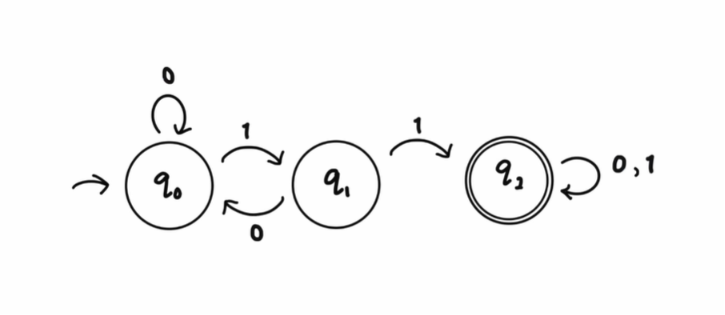

# Theory of Computation
---

## 📌 Index
1. [Theory of Computation](#theory-of-computation)
2. [Formal Languages](#formal-languages)
3. [Automata Theory](#automata-theory)


## What is Theory of Computation?
The Theory of Computation is a branch of computer science that deals with the fundamental capabilities and limitations of computers. It explores the mathematical models of computation, such as automata, formal languages, and Turing machines, to understand what can be computed and how efficiently it can be done.

### Key Questions Addressed:
1. **What can be computed?** (Computability)
2. **How efficiently can it be computed?** (Complexity)
3. **What models can we use to represent computation?** (Automata)

### Example:
Consider the problem: "Can we write a program that determines if another program will halt or run forever?"
- This is the famous **Halting Problem**
- Theory of Computation proves this is **impossible** to solve in general
- This demonstrates fundamental limitations of computation

---

## Formal Languages
A formal language is a set of strings (words) formed from a finite set of symbols (alphabet) according to precise rules.

### Alphabet (Σ)
A finite, non-empty set of symbols.

**Examples:**
- Σ₁ = {0, 1} (Binary alphabet)
- Σ₂ = {a, b, c} (Ternary alphabet)
- Σ₃ = {A-Z, a-z, 0-9} (Alphanumeric)

### Strings (w)
A string is a finite sequence of symbols from the alphabet.

**Examples with Σ = {a, b}:**
```
"a"      → valid string of length 1
"b"      → valid string of length 1
"ab"     → valid string of length 2
"aab"    → valid string of length 3
"abba"   → valid string of length 4
"ε"      → empty string (length 0)
```

**String Properties:**
- Length: |"abc"| = 3
- Concatenation: "ab" + "cd" = "abcd"
- Reverse: ("abc")ᴿ = "cba"
- Power: ("ab")² = "abab"

### Language (L)
A language is a set of strings over an alphabet.

**Example 1: Even-length binary strings**
```
Σ = {0, 1}
L = {ε, 00, 01, 10, 11, 0000, 0001, ...}
```

**Example 2: Palindromes**
```
Σ = {a, b}
L = {ε, a, b, aa, bb, aba, bab, aaa, bbb, ...}
```

**Example 3: Arithmetic expressions**
```
Σ = {0-9, +, -, *, /, (, )}
L = {"1+2", "3*4", "(5-2)*3", ...}
```

### Language Operations:

#### 1. Union (L₁ ∪ L₂)
Creates a language containing every unique string from either L₁ or L₂.

**Example:**
```
L₁ = {a, aa, aaa}
L₂ = {b, bb}
L₁ ∪ L₂ = {a, aa, aaa, b, bb}
```

#### 2. Intersection (L₁ ∩ L₂)
Contains only strings found in both L₁ and L₂.

**Example:**
```
L₁ = {a, ab, abc}
L₂ = {ab, abc, abcd}
L₁ ∩ L₂ = {ab, abc}
```

#### 3. Concatenation (L₁ · L₂ or L₁L₂)
Forms strings by appending any string from L₂ to any string from L₁.

**Example:**
```
L₁ = {a, b}
L₂ = {0, 1}
L₁L₂ = {a0, a1, b0, b1}
```

#### 4. Kleene Star (L*)
Concatenates zero or more strings from L. Always includes ε.

**Example:**
```
L = {a, b}
L* = {ε, a, b, aa, ab, ba, bb, aaa, aab, ...}
L⁰ = {ε}
L¹ = {a, b}
L² = {aa, ab, ba, bb}
```

#### 5. Complement (L̄)
All strings over Σ that are NOT in L.

**Example:**
```
Σ = {0, 1}
L = {strings ending with 0}
L̄ = {strings ending with 1} ∪ {ε}
```

### Regular Expressions
A notation for describing regular languages.

**Basic Operators:**
- **a** → matches symbol 'a'
- **ab** → concatenation (a followed by b)
- **a|b** → union (a or b)
- **a*** → zero or more a's
- **a+** → one or more a's
- **(a)** → grouping

**Examples:**
```
1. (0|1)*           → All binary strings
2. (a|b)*abb        → Strings ending with "abb"
3. [0-9]+           → One or more digits
4. (a*b*)*          → Any combination of a's and b's
5. (aa)*            → Even number of a's
```

---

## Automata Theory
Automata Theory is the study of abstract computing machines (automata) and the problems they can solve. These machines process input strings and determine whether to accept or reject them.

### Types of Automata:

### 1. Finite Automata (FA)
Finite Automata (FA) is the simplest computational model in automata theory. It is an abstract machine that processes input symbols one at a time and changes between a finite number of states according to predefined rules.

There are two types of Finite Automata:
1. **Deterministic Finite Automata (DFA)** - Exactly one transition for each state-symbol pair
2. **Non-deterministic Finite Automata (NFA)** - Multiple possible transitions for each state-symbol pair

---

### Deterministic Finite Automata (DFA)

A **Deterministic Finite Automaton (DFA)** is a finite automaton where for each state and input symbol, there is exactly one transition to a next state. This means the machine's behavior is completely determined by its current state and the current input symbol.

#### Definition

A Finite Automaton consists of:

**1. States (Q)** – Different conditions the machine can be in.
   - **Example:** Q = {q₀, q₁, q₂}
   - q₀: Initial/haven't seen "11" yet
   - q₁: Saw one "1", waiting for another
   - q₂: Saw "11", accepting state

**2. Input Alphabet (Σ)** – Set of allowed input symbols.
   - **Example:** Σ = {0, 1}
   - These are the only symbols the machine can read

**3. Transition Function (δ)** – Rules for moving between states.
   - **Example:** δ: Q × Σ → Q
   
   **Transition Table:**
   ```
   Current State | Input Symbol | Next State
   ============================================
        q₀       |      0       |     q₀
        q₀       |      1       |     q₁
        q₁       |      0       |     q₀
        q₁       |      1       |     q₂
        q₂       |      0       |     q₂
        q₂       |      1       |     q₂
   ```
   
   **Explanation:**
   - δ(q₀, 0) = q₀  → Stay in start state on '0'
   - δ(q₀, 1) = q₁  → Move to q₁ on first '1'
   - δ(q₁, 0) = q₀  → Reset on '0' after single '1'
   - δ(q₁, 1) = q₂  → Found "11", move to accept state
   - δ(q₂, 0) = q₂  → Stay in accept state (found "11")
   - δ(q₂, 1) = q₂  → Stay in accept state

**4. Start State (q₀)** – Where processing begins.
   - **Example:** q₀
   - Every computation starts here

**5. Accept/Final States (F)** – States that indicate the input is accepted.
   - **Example:** F = {q₂}
   - If we end in q₂, the string contains "11"

**Formal Notation:**
```
M = (Q, Σ, δ, q₀, F)
```

**Complete Example - DFA for strings containing "11":**
```
M = ({q₀, q₁, q₂}, {0, 1}, δ, q₀, {q₂})
```

**State Diagram:**




**Language Accepted:**
```
L(M) = {strings containing "11"}
```

**Example Executions:**

1. **Input: "0110"**
   ```
   Step 0: q₀, read '0' → q₀
   Step 1: q₀, read '1' → q₁
   Step 2: q₁, read '1' → q₂  ✓ (found "11")
   Step 3: q₂, read '0' → q₂
   Final: q₂ ∈ F → ACCEPT ✓
   ```

2. **Input: "101"**
   ```
   Step 0: q₀, read '1' → q₁
   Step 1: q₁, read '0' → q₀  (reset)
   Step 2: q₀, read '1' → q₁
   Final: q₁ ∉ F → REJECT ✗
   ```

3. **Input: "111"**
   ```
   Step 0: q₀, read '1' → q₁
   Step 1: q₁, read '1' → q₂  ✓ (found "11")
   Step 2: q₂, read '1' → q₂
   Final: q₂ ∈ F → ACCEPT ✓
   ```

4. **Input: "0101"**
   ```
   Step 0: q₀, read '0' → q₀
   Step 1: q₀, read '1' → q₁
   Step 2: q₁, read '0' → q₀  (reset)
   Step 3: q₀, read '1' → q₁
   Final: q₁ ∉ F → REJECT ✗
   ```

---

### Non-deterministic Finite Automata (NFA)

A **Non-deterministic Finite Automaton (NFA)** is a finite automaton where for each state and input symbol, there can be zero, one, or multiple possible transitions. The machine can also have ε-transitions (transitions without consuming any input).

#### Definition

An NFA consists of:

**1. States (Q)** – Finite set of states
**2. Input Alphabet (Σ)** – Set of input symbols
**3. Transition Function (δ)** – δ: Q × (Σ ∪ {ε}) → P(Q) (returns a set of states)
**4. Start State (q₀)** – Initial state
**5. Accept States (F)** – Set of accepting states

**Formal Notation:**
```
NFA = (Q, Σ, δ, q₀, F)
```

#### Key Differences: DFA vs NFA

| Feature | DFA | NFA |
|---------|-----|-----|
| **Transitions** | Exactly one per state-symbol | Zero, one, or many |
| **ε-transitions** | Not allowed | Allowed |
| **Next state** | Deterministic (single state) | Non-deterministic (set of states) |
| **Acceptance** | Single computation path | Multiple computation paths |
| **Power** | Equal (both recognize regular languages) | Equal (both recognize regular languages) |
| **Simplicity** | Larger (more states) | Smaller (fewer states) |


## Regular Operations on Automata
Automata can be combined using operations that correspond to language operations:
1. **Union (L₁ ∪ L₂)**: Combine two automata to accept strings from either language.
2. **Concatenation (L₁L₂)**: Create an automaton that accepts strings formed by concatenating strings from L₁ and L₂.
3. **Kleene Star (L*)**: Create an automaton that accepts any number of repetitions of strings from L.


## Pumping Lemma for Regular Languages

Pumping Lemma is a property that all regular languages satisfy. It provides a method to prove that certain languages are not regular.

### Statement of the Pumping Lemma

If L is a regular language, then there exists a pumping length p such that any string s in L with length at least p can be divided into three parts, s = xyz, satisfying the following conditions:
1. |y| > 0 (y is not empty)
2. |xy| ≤ p (the length of xy is at most p)
3. For all i ≥ 0, the string xy^i z is in L (the string can be "pumped" by repeating y any number of times)


### 2. Pushdown Automata (PDA)

Pushdown Automata (PDA) is a computational model that extends finite automata with an additional memory structure called a stack. This allows PDAs to recognize context-free languages, which are more powerful than regular languages.

### 3. Turing Machines (TM)
Turing Machines (TM) is a theoretical computational model that can simulate any algorithm. It consists of an infinite tape divided into cells, a tape head that can read and write symbols, and a state register that holds the current state of the machine. Turing Machines are used to characterize computability and to define what it means for a function to be computable.


### Chomsky Hierarchy
The Chomsky Hierarchy classifies formal languages based on their generative power and the types of grammars that can generate them. It consists of four levels:

| Grammar Type | Language Class                   | Automaton                     |
| ------------ | -------------------------------- | ----------------------------- |
| Type 3       | Regular Languages                | DFA/NFA                       |
| Type 2       | Context-Free Languages           | PDA                           |
| Type 1       | Context-Sensitive Languages      | Linear Bounded Automata (LBA) |
| Type 0       | Recursively Enumerable Languages | Turing Machine                |
